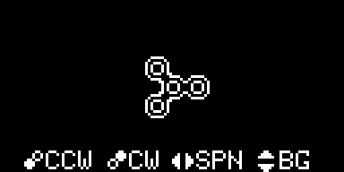

# FidgetSpinner-Arduboy

A very simple fidget spinner simulator for Arduboy, as if there aren't enough fidget spinners already.

You can spin the spinner clockwise or counter-clockwise, as well as change the design of the spinner.

## Controls
* **A Button**: spin counter-clockwise
* **B Button**: spin clockwise
* **Left/Right button**: change the design of the spinner
* **Up/Down button**: change the background color

## How to run
* Upload the .arduboy or .hex file using tools like [Arduboy Game Loader](http://team-arg.org/agl-tool.html)
* Build the sketch using the Arduino IDE

## Credits
* [Tiago Bento (Trigonated)](https://github.com/trigonated): author of this game
* [Josh Goebel](https://github.com/yyyc514): author of the [img2ard](https://github.com/yyyc514/img2ard) script
